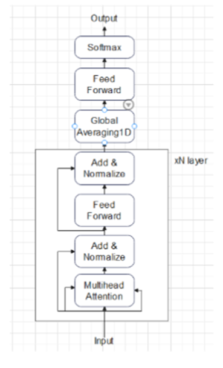

# LLM-Encoder-Only---Text-and-Audio

This model is based on Large Language Model. That I use Transformer Encoder to extract feature from 2D-data input.

This project is the next part of my [previous project: ](https://github.com/Song812ads/WebHandGesture) Control 6LoWPAN with hand sign and now I control it with text and voice.

This is the model architecture that I use for all kinds of data. About the theory of this architecture I have write it in Vietnamese in model/ directory of previous proect. In this note, I just write about how to create 2D data for 2 kinds of data

Source code is in audio/ and text/ directory.

<b>1. Text classification: </b>

<b>1a. Word2vec:</b>

Word2vec is one of the first model for word embedding. Firstly, I wil train my dataset with Word2vec. Word2vec will capture the word that most appear in dataset. If 1 word appear more than a threshold in dataset it will be a word in dictionary. And the word is not in dataset or less than this threshold will be eliminated if we train or test. Moreover, word2vec will create a 2D-matrix representation for each words in dictionary. This matrix is base on how 1 word relate to another word caculate in window of each sentence.

So for example, my dictionary is: ['led', '1', 'on','off']
The sentence is 'Today is hot. led is off please' will change to 'Led 1 off' and then will send to Transformer model to predict. This model is good for some simple case and if use it for large problems we must consider about dataset for word to capture.

<b>1b. Transformer Tokenizer: </b>
 
In this method, you can use pretrained model that will create a fully dictionary or you can train your dataset and create a dictionary that if the word is appear more frequently in your dataset the value of it will be less.

After tokenizing all the word in dataset, the word that not in dataset will be <oov>. After that, you can get it through embedding and positional encoding in Transformer to create 2D array for the model.

<b>2. Audio Classification:</b>
<b>2a. LogmelSpectrogram: </b>

This is the traditional method that we use stft n_mels bin to create 2D array to capture frequency information following time. This 2D array then padding because audio can have different time-long. Then I will send it to the model to predict.

<b>2b. Wav2vec - CNN for audio feature extraction</b>

In this method, after I receive raw data from audio file, I will normalize all the data and send it to CNN. I have test that I just use 1 layer of CNN and the result become fairly well and result is much higher than logmelspectrogram method. But the real wav2vec that require 7 layers of CNN. 

The data after CNN with go through Conv1D that actually need to reshape from 1D raw data to 2D data at begin so the output can go to my model and then predict. 
